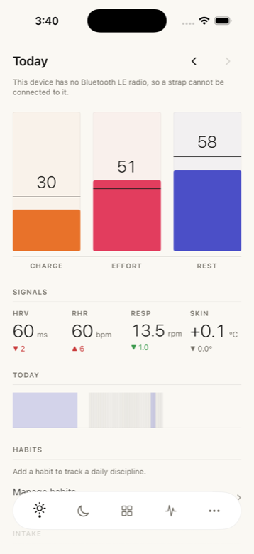
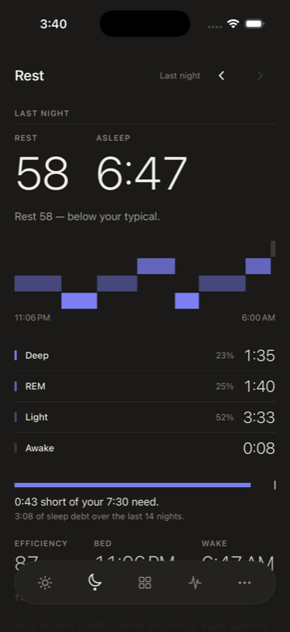
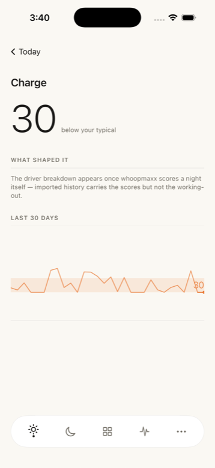
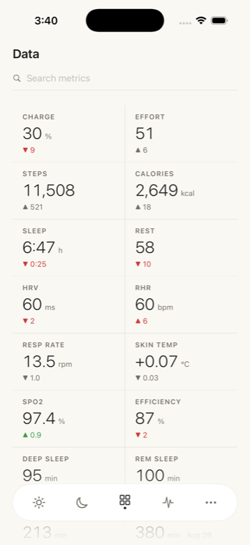

# whoopmaxx

A standalone iPhone companion for a WHOOP strap. Your band talks to your phone over Bluetooth,
and the data stops there.

No account. No cloud. No subscription. No telemetry. Nothing leaves the device unless you export
it yourself.

Not affiliated with, sponsored by, or endorsed by WHOOP, Inc. Contains no WHOOP source code,
firmware, or assets.

---

<p align="center">
  
  
  
  
</p>

<p align="center"><sub>Simulator screenshots on seeded demo data. The banner on the first one is real:
the simulator has no Bluetooth radio, and the app says so instead of pretending.</sub></p>

## What it does

- **Connects to the strap directly** — WHOOP 4.0 and 5.0/MG — and pulls its recorded history,
  plus live heart rate and beat-to-beat intervals.
- **Scores your day** as Charge (recovery), Effort (cardiovascular load), and Rest (sleep quality),
  each against baselines learned from your own nights rather than a population.
- **Stages your sleep** into wake / light / deep / REM, with the AASM-style numbers underneath:
  time asleep, efficiency, wake after sleep onset, REM latency, stage minutes.
- **Explains itself.** Every score can show the drivers behind it, and every derived figure says
  what it is estimated from.
- **Says nothing rather than guessing.** A night the strap did not record is blank, not zero. A
  score computed from a half-captured day is marked as such instead of quietly looking normal.

There is also a body clock view, a signal lab for looking at raw streams, workout detection with a
Live Activity, home- and lock-screen widgets, a smart alarm that wakes you with the strap's own buzz
inside a window you set, journaling with effect ranking, intake tracking, sleep debt, opt-in export
to Apple Health, and backup/restore to a single file you own.

## Honesty about the numbers

This is a wrist device and a phone. It does not measure what a sleep lab measures.

- Sleep stages are an **estimate** from heart rate, motion, and beat intervals. No wrist device
  reads EEG, so "deep" here means an autonomic signature consistent with deep sleep — never a
  scored N3 epoch.
- Respiratory rate is derived from the beat intervals, not a dedicated sensor.
- Calories use published population equations fitted to other people, not to you.
- Skin temperature is reported as a **deviation from your own baseline**, never as a clinical
  absolute.
- Nothing here is a medical device, and none of it is advice.

Where a number cannot be honestly produced, the app shows its absence and the reason.

## Requirements

- iPhone on iOS 26 or later
- A WHOOP 4.0 or 5.0/MG strap that is already yours
- A way to install an app outside the App Store (see below)

## Installing

There is no App Store build. You install it yourself.

```sh
./scripts/build-ipa.sh        # -> ~/Downloads/whoopmaxx.ipa
```

Then sideload that `.ipa` with AltStore, SideStore, or your own signing setup.

**Do not build a bare unsigned `.ipa` by hand.** `CODE_SIGNING_ALLOWED=NO` skips entitlement
processing, so the app ships with no App Group — the widget then silently stops sharing state with
the app, and nothing tells you. The script ad-hoc signs the entitlements in and verifies they
landed.

A free Apple developer account signs apps for seven days at a time, so a sideloaded install needs
periodic re-signing. The app tells you how long its own signature has left.

## Building from source

```sh
xcodegen generate     # only after project.yml changes
xcodebuild -project whoopmaxx.xcodeproj -scheme whoopmaxx \
  -destination 'platform=iOS Simulator,name=iPhone 17' build
```

The simulator has no Bluetooth, so UI work runs on seeded demo data (`--seed-demo`). Real strap
behaviour has to be tested on a device.

## Layout

| Path | What lives there |
|---|---|
| `Packages/StrapProtocol` | Bluetooth framing and record decoding |
| `Packages/StrapStore` | The SQLite store |
| `Packages/StrapAnalytics` | Scores, baselines, sleep staging |
| `Core/` | Connection, collection, orchestration |
| `App/` | Every screen and the design system |
| `Tests/` | The acceptance suite |

## Licence

**PolyForm Noncommercial 1.0.0** — free to use, modify and share for any noncommercial purpose.
See [LICENSE](LICENSE).

That is inherited, not chosen. The Bluetooth connection and collection layer under `Core/BLE` and
`Core/Collect` derives from [ParthJadhav/noop](https://github.com/ParthJadhav/noop), which is
licensed under those terms, and a derivative cannot be relicensed more permissively than its
source.

The three packages under `Packages/` — the protocol decoder, the store, and the analytics engine —
were written for this repository from MIT-licensed sources, share no code with that layer, and are
separately available under the **MIT License** ([Packages/LICENSE](Packages/LICENSE)) if they are
useful to you on their own.

Full attribution is in [NOTICE.md](NOTICE.md).
